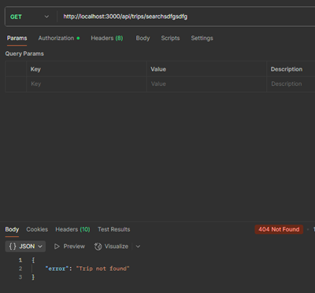

# Welcome to My CS499 ePortfolio {#top}

Thank you for visiting my ePortfolio! This site showcases my final project for the Computer Science Capstone at SNHU, including:

- My professional self-assessment
- The original project artifacts comprising the MEAN stack Travlr Trip Listings application from CS465
- A code review video, submitted as Milestone One in this course
- Three enhancements to the Travlr Trip Listings project (Milestones Two, Three, and Four)
- Narratives explaining each enhancement and its alignment with program outcomes

> 🔒 For security and academic integrity reasons, the project repository is private. If you're a reviewer or instructor, please contact me directly [here](mailto:jose.garza4@snhu.edu).

---

### 🔗 Quick Navigation

- [Professional Self-Assessment](#self-assessment)
- [Travlr Trip Listings: Original Project](#original)
- [Code Review Video](#code-review)
- [Enhancement One](#enhancement-one)
- [Enhancement Two](#enhancement-two)
- [Enhancement Three](#enhancement-three)

---

## 🧠 Building Secure, Scalable Solutions: My Self-Assessment {#self-assessment}

Over the course of the Computer Science program at SNHU, I’ve evolved from a novice developer into a strategic, security-focused engineer who builds narratable, modular, and professionally aligned applications. This ePortfolio reflects that transformation, showcasing the broader skills, values, and experiences I’ve cultivated throughout the program. Through my years at SNHU, various assignments and projects challenged me to think critically about software architecture, security, and user experience.

Courses in software engineering, algorithms, databases, and cybersecurity laid the foundation for my technical depth, while the capstone project helped me synthesize those lessons into a cohesive, real-world application. For example, the CS-405 Secure Coding course bolstered me as a developer to think beyond functionality and to protect users, applications, and data through integrating secure practices at all possible points in the Software Development Lifecycle. An instance of this was protecting an application against buffer overflow due to a lack of user input validation, allowing for more characters to exceed the user input array’s limit. To prevent this, we checked input length, rejected oversized entries, cleared the input stream, and prompted the user to retry with fewer than 20 characters as follows:

```cpp
char user_input[20];

// Previously, the code allowed for unsafe input like this:
// std::cout << "Enter a value: ";
// std::cin >> user_input;

// Use getline to read input and prevent buffer overflow
while (true) {
    std::cout << "Enter a value (max 19 characters): ";
    std::cin.getline(user_input, sizeof(user_input));

    // Check if input was too long
    if (std::cin.fail()) {
        std::cin.clear(); // Clear error state
        std::cin.ignore(std::numeric_limits<std::streamsize>::max(), '\n'); // Flush overflow

        std::cerr << "Input too long! Please enter fewer than 20 characters.\n";
    } else {
        break; // Valid input
    }
}

std::cout << "You entered: " << user_input << std::endl;
```
This experience taught me to anticipate edge cases and design defensively, which is a mindset I now apply across all projects.

Another great skill I developed during my academic career at SNHU is debugging code effectively to identify issues. One memorable time was while developing a pedometer mobile application in the Android Studio using SensorManager. To watch the application in more detail, I enabled breakpoints in the code and ran the application in debug mode.  Stepping through each breakpoint showed each update to variables based on the movement detected by the sensor:


Debugging in Android Studio sharpened my ability to trace sensor-driven logic and isolate variable state changes, a skill I’ve carried into more complex systems.

## 🤝 Development, Collaboration, and Communication

While much of my development work was independent, I collaborated with peers through code reviews, discussion forums, and shared repositories such as GitHub. I practiced asynchronous teamwork by resolving merge conflicts, aligning shared goals, and giving constructive feedback. These experiences sharpened my ability to work in a team environment and adapt to different communication styles.
The following areas showcase application of my skills:

## 🧩 Core Competencies

- **Team Collaboration**  
  Throughout my tenure at SNHU as well as my professional experience, I have led and been a member of small and large teams, fostering cross-functional team collaboration, fielding various communication styles, and supporting both direct and indirect efforts to achieve overall team impact. To support my efforts in this regard, I have experience using Visual Studio, Azure DevOps for story boards and code lifecycle management, GitHub, Microsoft Teams, SharePoint, and more. I value honesty, transparency, and direct language in collaborative situations.

- **Stakeholder Communication**  
  I enjoy translating projects and their requirements, objectives, and milestones to both technical and non-technical audiences. Be it live presentations to leaders, training to users, or technical documentation, my aim is to always ensure that technical designs and solutions are easily understood to all audiences.

- **Data Structures & Algorithms**  
  I apply core structures such as arrays, lists, stacks, and hash maps as needed to solve problems effectively. I’ve implemented recursive and iterative algorithms for sorting, searching, and traversal. Additionally, I evaluate how fast an algorithm runs (time complexity: e.g. linear O(n) vs. quadratic O(n²)) and how much memory it uses (space complexity: e.g. storing extra arrays, recursion stack depth) before choosing or implementing a solution. This helps me pick the most efficient and scalable approach, especially when handling large datasets, nested loops, or recursive functions. I balance algorithmic challenges between performance with maintainability.

- **Software Engineering & Database**  
  I design modern solutions using cloud and serverless architectures. I prioritize principles such as separation of concerns, clear comments and documentation, and debug/test tools and practices. I normalize database schemas, enforce validation rules, and optimize queries through indexing and thoughtful data modeling. I am comfortable with traditional relational on-premises database engines such as Microsoft SQL and Oracle, cloud NoSQL databases such as MongoDB, or serverless varieties such as Cosmos DB and DynamoDB.

- **Security**  
  I embed secure coding practices across all layers of development. This includes input sanitization, role-based access control, authentication and authorization, and schema enforcement. I’m familiar with threat modeling, OWASP guidelines, and cloud-based IAM policies. Protecting applications, data, and users are pinnacle concerns during the development process.

While I’ve gained a wide range of skills, the best demonstration of my technical and strategic growth is captured in my capstone project: Enhancements to the MEAN stack Travlr Trip Listings app.

## 🧵 Capstone Artifact Summary and Portfolio Summary

The following code review and artifacts in this portfolio form a cohesive narrative of my growth. Each enhancement builds on the last:

- RBAC roles using route guards and service-level authorization checks  
- Reactive form validation  
- API modularity  
- Search with fuzzy matching, compound indexing, and partial matching  
- Input sanitizing  
- Schema validation

Together, they demonstrate my ability to develop and improve complex systems, prioritizing security and user experience. My desire is to deliver similar best practice solutions and create real-world impact. Each artifact on display is linked to a GitHub repository, organized by enhancement branches, with structured content for reviewer clarity.

[⬆️ Back to Top](#top)

---

## Original Artifact: Travlr Project (CS465) {#original}

This is the original version of the Travlr MEAN stack application, created during CS 465: Full-Stack Development I (July - August 2025) before any enhancements were applied.

The artifact began as an Express server-rendered HTML/Handlebars implementation and was later refactored into a modular Angular Single Page Application (SPA) later in the class. This refactoring allowed me to apply Separation of Concerns (SoC), improve maintainability, and align with modern front-end architecture standards.  

🔗 <a href="https://github.com/joselgarza/cs465-fullstack/tree/main" target="_blank">View Original Project (Main Branch)</a>

[⬆️ Back to Top](#top)

---

## Code Review Video {#code-review}

<iframe width="560" height="315" src="https://www.youtube.com/embed/OFDothTvoj4" title="Travlr Project Code Review" frameborder="0" allowfullscreen></iframe>

[⬆️ Back to Top](#top)

---

## Enhancement One: Software Design & Engineering {#enhancement-one}

This enhancement focused on modularizing the Angular frontend, implementing route guards, and adopting standalone architecture.

🔗 <a href="https://github.com/joselgarza/cs465-fullstack/tree/enhancement-one" target="_blank">View Enhancement One Branch</a>

<details>
<summary><strong>📘 Read Enhancement Narrative</strong></summary>
<br>
<h3>🧩 Artifact Description</h3>

<p>
The artifact is a modular Angular application originally developed in a prior course (<strong>CS-465 Full-Stack Development I</strong>) on <strong>August 18, 2025</strong>. It includes user and admin views for managing travel listings.
</p>

<p>
The focal point of my enhancements for this project lies in the original admin Angular site in the <code>./app_admin/</code> directory. The original code relied on a legacy service (<code>TripData</code>) and lacked modularity, role-aware logic (any user could perform CRUD operations on the trips listed), and shared UI enhancements.
</p>

<p>
I began enhancing this artifact in the week of <strong>September 15, 2025</strong>, as part of <strong>CS-499</strong>.
</p>

<h3>✅ Justification for Inclusion</h3>

<p>
I selected this artifact because it showcases my ability to refactor legacy code into a maintainable, modular architecture while aligning with a strategic enhancement plan. I originally remember my first go with the original project, wishing I had more time to improve various aspects of the framework presented. The work demonstrates my skills in secure design, service abstraction, and user experience optimization.
</p>

<p>Specifically, I implemented:</p>

<ul>
  <li><strong>Role-Based Access Control (RBAC):</strong> Introduced user vs admin roles throughout the application to support differentiated access and layout logic
      <br>
      
      <br>
      
  </li>
  <li><strong>Route Guards:</strong> Protected administrative routes (<code>AddTrip</code>, <code>EditTrip</code>) using Angular route guards to enforce role-based navigation</li>
  <li><strong>Service-Level Authorization Checks:</strong> Centralized role and token validation logic to ensure secure, maintainable access control across components
      <br>
      
  </li>
  <li><strong>Reactive Form Validation in Login:</strong> Implemented real-time validation feedback for login credentials to improve usability and reduce authentication errors
      <br>
      
  </li>
  <li><strong>API Abstraction via <code>TripService</code> and <code>AuthService</code>:</strong> Refactored legacy logic into modular services for trip and authentication operations, improving maintainability and separation of concerns</li>
  <li><strong>Shared Search Functionality:</strong> Added a reactive <code>SearchService</code> and centralized UI search input in the navigation bar to enable real-time trip filtering across both user and admin views
      <br>
      
  </li>
</ul>

<p>
These enhancements align with software engineering best practices and demonstrate my ability to deliver impactful improvements that span architecture, security, and user experience.
</p>

<h3>🎯 Course Outcomes Met</h3>

<p>
This enhancement demonstrates substantial progress toward the following Computer Science program outcomes:
</p>

<ul>
  <li><strong>Design and evaluate computing solutions:</strong> I refactored legacy trip logic into modular services and implemented reactive search and form validation to solve usability and maintainability challenges using algorithmic principles and modern Angular practices.</li>
  
  <li><strong>Demonstrate innovative techniques in software engineering/design/database:</strong> I abstracted API calls into dedicated services (<code>TripService</code>, <code>AuthService</code>), implemented role-based access control (RBAC), and added route guards and service-level authorization checks to enforce secure, scalable architecture.</li>
  
  <li><strong>Develop a security mindset:</strong> I anticipated potential vulnerabilities by restricting access to administrative routes, validating user roles at both the routing and service levels, and improving authentication flows to ensure privacy and protect sensitive operations.</li>
  
  <li><strong>Deliver professional-quality communication:</strong> I narrated each enhancement with clarity and strategic intent, aligning my technical decisions with rubric expectations and preparing the artifact for ePortfolio presentation and instructor review.</li>
</ul>

<h3>🔍 Reflection on the Enhancement Process</h3>

<p>
Enhancing this artifact taught me how to sequence improvements for maximum impact. I began by refactoring trip logic into a modular service, then layered in reactive search and role-aware layout logic. I faced challenges adapting legacy code to modern Angular architecture, especially when replacing <code>TripData</code> and ensuring parity across components. I also had to troubleshoot route guards and conditional rendering to ensure seamless user experience. I found that I spent as much time troubleshooting as I did improving. Some initial improvements broke existing, well-behaved features, so that took time to unravel and align properly.
</p>

<p>
To reinforce role-based access control, I implemented admin and user roles, extended the user attribute in the database schema to support roles, and used Angular route guards to restrict access to administrative routes such as <code>AddTrip</code> and <code>EditTrip</code>. These guards validate the user's role before allowing navigation, ensuring that only authenticated admins can modify trip data. This enhancement strengthens the application’s security posture and aligns with best practices for protecting sensitive operations in multi-role systems.
</p>

<p>
When considering enhancements to the <code>AddTrip</code> and <code>EditTrip</code> forms, I found that reactive form validation was already implemented in the original artifact. Rather than duplicating effort, I focused on preserving that functionality while refactoring the underlying service logic to use the new <code>TripService</code>. This decision reflects my ability to prioritize impact and avoid unnecessary rework.
</p>

<p>
In addition to preserving reactive validation in the <code>AddTrip</code> and <code>EditTrip</code> forms, I implemented reactive form validation for the login page. I had originally added some light validation (which was not part of the project at that time but I could not in good faith leave it in such a state), but this was an attempt to use native tools in Angular to perform validation with minimal overhead. This enhancement ensures that users receive immediate feedback when submitting incomplete credentials, improving usability and reducing authentication errors. It also aligns with best practices for secure and user-friendly form design.
</p>

<p>
Through this process, I strengthened my ability to plan strategically, refactor methodically, and narrate technical decisions for academic and professional audiences. These enhancements not only improved the application but also deepened my understanding of modular design, maintainable architecture, and secure software engineering practices.
</p>

<p>
Moving forward, one lesson learned is to take each part of an overall enhancement one session at a time rather than cram entire solutions in. This will help minimize the amount of rework while helping me focus on each improvement with a clear and relaxed mind. Sometimes the more I do, the more I make mistakes. As the solution grows with each enhancement, I can see time management as well as a more risk-averse approach to be helpful.
</p>

</details>
<br>
[⬆️ Back to Top](#top)

---

## Enhancement Two: Algorithms & Data Structures {#enhancement-two}

This enhancement restored backend search functionality, refined regex validation, and handled edge cases.

🔗 <a href="https://github.com/joselgarza/cs465-fullstack/tree/enhancement-two" target="_blank">View Enhancement Two Branch</a>

<details>
<summary><strong>📘 Read Enhancement Narrative</strong></summary>
<br>
<h3>🧩 Artifact Description</h3>

<p>
The artifact is a modular Angular application originally developed in <strong>CS-465 Full-Stack Development I</strong> on <strong>August 18, 2025</strong>. It includes user and admin views for managing travel listings. My enhancements focus on the admin Angular site located in the <code>/app_admin/</code> directory.
</p>

<p>
For Enhancement Two, I extended the backend and frontend functionality to support full-stack search with pagination and fuzzy matching. This enhancement builds on the modular architecture established in Enhancement One and introduces a new search endpoint in the Express backend, integrated with the Angular admin interface.
</p>

<h3>✅ Justification for Inclusion</h3>

<p>
I selected this enhancement to demonstrate my ability to implement layered search logic, integrate backend and frontend components, and troubleshoot full-stack communication. The original artifact lacked any backend search capability and relied solely on client-side filtering. This enhancement showcases my skills in RESTful API design, MongoDB query optimization, and user experience polish.
</p>

<p>Specifically, I implemented:</p>

<ul>
  <li><strong>Full-Stack Search Endpoint:</strong> Created a new Express route (<code>/api/trips/search</code>) that supports full-text and fuzzy search across trip fields
      <br>
      
  </li>
  <li><strong>Pagination Support:</strong> Enabled query parameters (<code>searchTerm</code>, <code>page</code>, <code>limit</code>) to control result size and navigation
      <br>
      
  </li>
  <li><strong>MongoDB <code>$text</code> Search:</strong> Leveraged native text indexing for relevance scoring
      <br>
      
  </li>
  <li><strong>Fuzzy Matching with fast-fuzzy:</strong> Implemented a fallback search strategy to catch near-matches and typos
      <br>
      
  </li>
  <li><strong>Frontend Integration via <code>TripService</code>:</strong> Refactored the Angular service to call the backend endpoint with query parameters
      <br>
      
  </li>
  <li><strong>UX Polish:</strong> Preserved the “No results found” message and ensured consistent response formatting for frontend rendering
      <br>
      
  </li>
  <li><strong>Backend Resilience:</strong> Debugged and resolved parsing errors, route misconfigurations, and temporal dead zone issues to ensure stable operation
      <br>
      
  </li>
</ul>

<p>
These enhancements align with software engineering best practices and demonstrate my ability to deliver narratable, strategic improvements that span backend logic, frontend integration, and user experience.
</p>

<h3>🎯 Course Outcomes Met</h3>

<p>
This enhancement demonstrates substantial progress toward the following Computer Science program outcomes:
</p>

<ul>
  <li><strong>Design and evaluate computing solutions:</strong> I designed a layered search strategy that combines full-text and fuzzy logic, evaluated its performance, and integrated it into the existing architecture using RESTful principles.</li>
  <li><strong>Demonstrate innovative techniques in software engineering/design/database:</strong> I implemented MongoDB <code>$text</code> search, fuzzy matching with fast-fuzzy, and pagination logic to deliver scalable and user-friendly search functionality.</li>
  <li><strong>Develop a security mindset:</strong> I ensured that the search endpoint returned consistent, sanitized responses and avoided exposing sensitive backend errors to the client.</li>
  <li><strong>Deliver professional-quality communication:</strong> I narrated each enhancement with clarity and strategic intent, aligning my technical decisions with rubric expectations and preparing the artifact for ePortfolio presentation and instructor review.</li>
</ul>

<h3>🔍 Reflection on the Enhancement Process</h3>

<p>
Enhancing this artifact taught me how to sequence backend and frontend improvements for clarity. I began by designing the search endpoint, then layered in full-text and fuzzy logic, followed by pagination and frontend integration. I faced challenges with JSON parsing errors, proxy misrouting, and variable scoping in the backend. These issues required methodical debugging and reinforced the importance of clear response formatting and defensive coding.
</p>

<p>
One key lesson was the importance of narratable fallback logic. When MongoDB’s <code>$text</code> search failed to match typos like “daweson,” the fuzzy fallback ensured that users still received relevant results. This layered approach reflects my ability to anticipate edge cases and design resilient systems.
</p>

<p>
I also learned to manage verbosity in backend logging. During testing, I logged entire result sets to the console, which became overwhelming. I refined this by summarizing result counts and search terms, maintaining traceability without sacrificing clarity.
</p>

<p>
Through this process, I strengthened my ability to plan enhancements strategically, troubleshoot full-stack issues methodically, and narrate technical decisions. Moving forward, I will continue to sequence enhancements in focused sessions, balancing ambition with feasibility and maintaining clarity throughout.
</p>

</details>
<br>
[⬆️ Back to Top](#top)

---

## Enhancement Three: Databases {#enhancement-three}

This enhancement added compound indexing, normalized schema inputs, and improved validation logic.

🔗 <a href="https://github.com/joselgarza/cs465-fullstack/tree/enhancement-three" target="_blank">View Enhancement Three Branch</a>

<details>
<summary><strong>📘 Read Enhancement Narrative</strong></summary>
<br>
<p><strong>Description of Artifact:</strong><br>
The original artifact for this enhancement was the MongoDB database layer supporting the Travlr Trip Listings MEAN stack app, created during CS465 (July–August 2025).</p>

<p><strong>Justification for Enhancements:</strong><br>
The original implementation lacked advanced indexing and schema validation. This enhancement focused on improving query performance, input integrity, and search capabilities. I added a <code>$text</code> index on key fields like destination and description, created compound indexes (e.g., destination + date), and enforced schema validation using Mongoose to prevent injection and ensure data consistency.</p>

<p><strong>Reflection on the Enhancement Process:</strong><br>
Enhancing this artifact taught me how to sequence backend and frontend improvements for narratable clarity. I began by refining the trip schema, ensuring the full text search, then layered in compound indexing, followed by frontend validation and backend query precision. I faced challenges with exact string matching, millisecond-level date alignment, and index usage verification. These issues required methodical debugging and reinforced the importance of data integrity and query design. I could still improve the search experience, further error handling, and more, but I wanted to stay within scope of this enhancement as well as the overall project.</p>

<p>One key lesson was the importance of validating index usage with <code>.explain()</code>. Even when indexes were defined correctly, MongoDB’s query planner required exact matches to trigger them. I learned to inspect stored values, adjust query formats, and use range queries when necessary. This reinforced my ability to debug backend logic with surgical precision. It was interesting to find that while compound searching required exact values, the search bar in the UI utilizes fuzzy search for a much better experience.</p>

<p>I also learned to align frontend validation with backend schema rules. By showing inline error messages as soon as fields were touched or typed into, I improved user experience and reduced backend rejections. This narratable polish reflects my empathy for users and attention to edge cases. Although I began with putting further constraints in the Angular forms, I found that the add-trip HTML did not deliver any handling messages to the admin, leaving them to fend for themselves on why they could not add a trip. I couldn’t leave it as is and further introduced input handling and validation which aligned to the previous database schema enhancements.</p>

<p>As if that wasn’t enough, when the form was being tested and bad or unexpected data hit the backend after the improvements, the server would crash and halt the website hosting. I identified that the <code>addTrip</code> function in the Trip class needed to handle the exception flagged by the newly introduced backend data validation properly. I did this with a <code>try/catch</code>. This was the result of the server operation, before and after:</p>

<p></p>

<p>As you can see, there was an expected validation error with ‘code’ due to the Regex, but then npm would crash. After the <code>try/catch</code> handling, a proper 400 validation now logs in the console, allowing the server to continue normal operations.</p>

<p>Through this process, I strengthened my ability to plan enhancements strategically, troubleshoot backend issues methodically, and narrate technical decisions with clarity. I have found that, while introducing backend improvements, frontend improvements needed attention to really bring the value home. The nature of the full-stack application proved the same in the last enhancement when I introduced the search bar. Without the full text and fuzzy search at a minimum, the search bar would do nothing at all. The entire project experience has been rewarding overall, and it was a wise choice to scale back in my original plan when I did so that I could make all the required improvements holistically throughout the process.</p>

</details>
<br>
[⬆️ Back to Top](#top)

